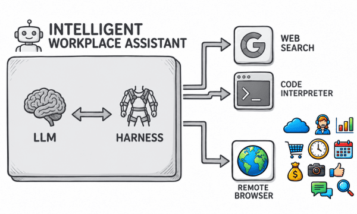

# Remote Browser

Remote Browser is an [open-source](https://github.com/remotebrowser/remotebrowser), [self-hostable](self-hosting.md) tool for every autonomous assistant. It creates [isolated, sandboxed browser environments](isolation.md) for every user, always on and accessible 24/7 from anywhere at any time, delivering robust privacy, strict access control, and a complete audit trail.

Working through its harness, an LLM (large language model) can remotely control these browsers to automate complex workflows: preparing employee onboardings, managing expenses, generating sales reports, conducting market research, and many more.

Remote Browser works with the common web automation tools ([Playwright](https://playwright.dev), [Puppeteer](https://pptr.dev), etc), with autonomous coding assistants ([Claude Code](https://claude.com/product/claude-code), [ChatGPT Codex](https://openai.com/codex), [Cursor](https://cursor.com), [Antigravity](https://antigravity.google), [OpenCode](https://opencode.ai), etc), and with the new generation of intelligent assistants ([OpenClaw](https://openclaw.ai), [Hermes](https://hermes-agent.nousresearch.com), [Pi](https://pi.dev), etc).
