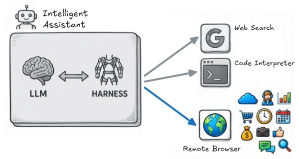

# Remote Browser

Remote Browser is a [self-hosted](self-hosting.md) sandbox browser system for your team. Each user can provision one or multiple [isolated browsers](isolation.md) as needed.

Intelligent assistants, driven by an LLM and a harness, can remote control these isolated browsers to automate complex business workflows: preparing employee onboardings, managing expenses, generating sales reports, conducting market research, and many more.

Remote Browser works with the common web automation tools ([Playwright](https://playwright.dev), [Puppeteer](https://pptr.dev), etc), with autonomous coding assistants ([Claude Code](https://claude.com/product/claude-code), [ChatGPT Codex](https://openai.com/codex), [Cursor](https://cursor.com), [Antigravity](https://antigravity.google), [OpenCode](https://opencode.ai), etc), and with the new generation of personal assistants ([OpenClaw](https://openclaw.ai), [Hermes](https://hermes-agent.nousresearch.com), [Pi](https://pi.dev), etc).
