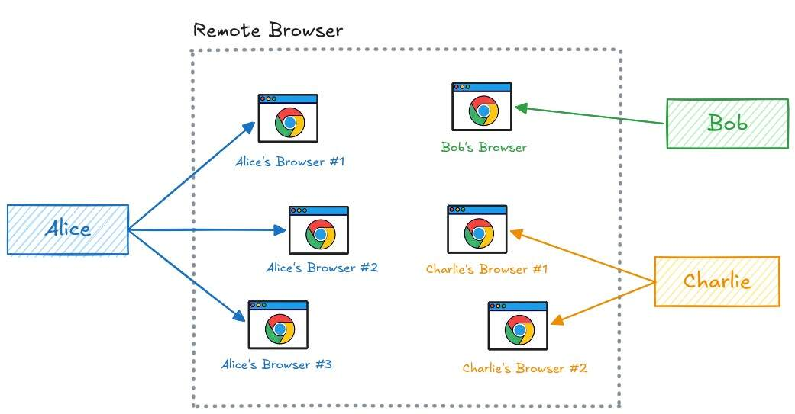

# Isolation

Remote Browser runs each Google Chrome browser in its own container. This keeps every browser isolated from the others and from the host.

Each container starts empty and holds only the session of the browser it runs. Users reach their own browsers through the app, and one user cannot reach another user's browsers.

The diagram shows three users on a single Remote Browser system. Alice is a software engineer who needs to read documentation for an internal company service, research different technical trade-offs, and test the apps she is working on. She starts three browsers and uses them at the same time.

Meanwhile, Bob works in accounting and is happy automating his workflow with only a single browser.

For product research, Charlie needs to remote-control two different browsers while on the go. He accesses them using his LLM-powered assistants through Telegram.

Each browser is a separate container, so what one user does inside their browser cannot affect any other browser running on the same host.
